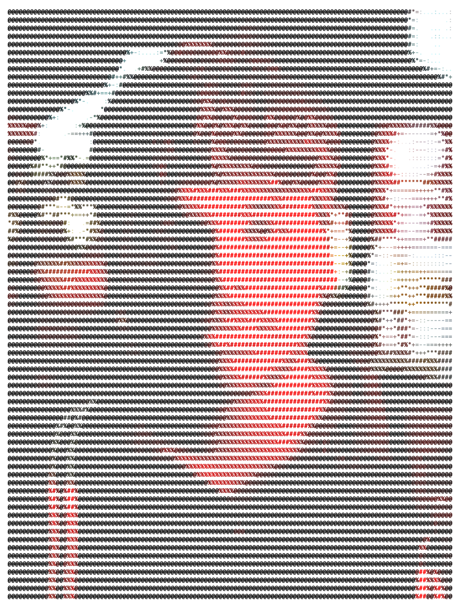

<h1 align="center">Hey, I'm Amarnath 👋</h1>

  

  <b>AI Engineer · Full-Stack Developer · Hardware Hacker · 3D Enthusiast</b>

  I build things that sit at the intersection of <b>AI, software, hardware, and 3D</b>.
  From browser extensions powered by LLMs to IoT automation platforms and interactive 3D simulations — if it's novel and a little ambitious, I'm in.

---
## 💬 Let's Connect

I'm always open to interesting problems, collaborations, or a good conversation about AI and hardware.

> *"Build things that push boundaries — software, hardware, and everything in between."*

<!--
**amarnath3003/amarnath3003** is a ✨ _special_ ✨ repository because its `README.md` (this file) appears on your GitHub profile.

Here are some ideas to get you started:

- 🔭 I’m currently working on ...
- 🌱 I’m currently learning ...
- 👯 I’m looking to collaborate on ...
- 🤔 I’m looking for help with ...
- 💬 Ask me about ...
- 📫 How to reach me: ...
- 😄 Pronouns: ...
- ⚡ Fun fact: ...
-->
